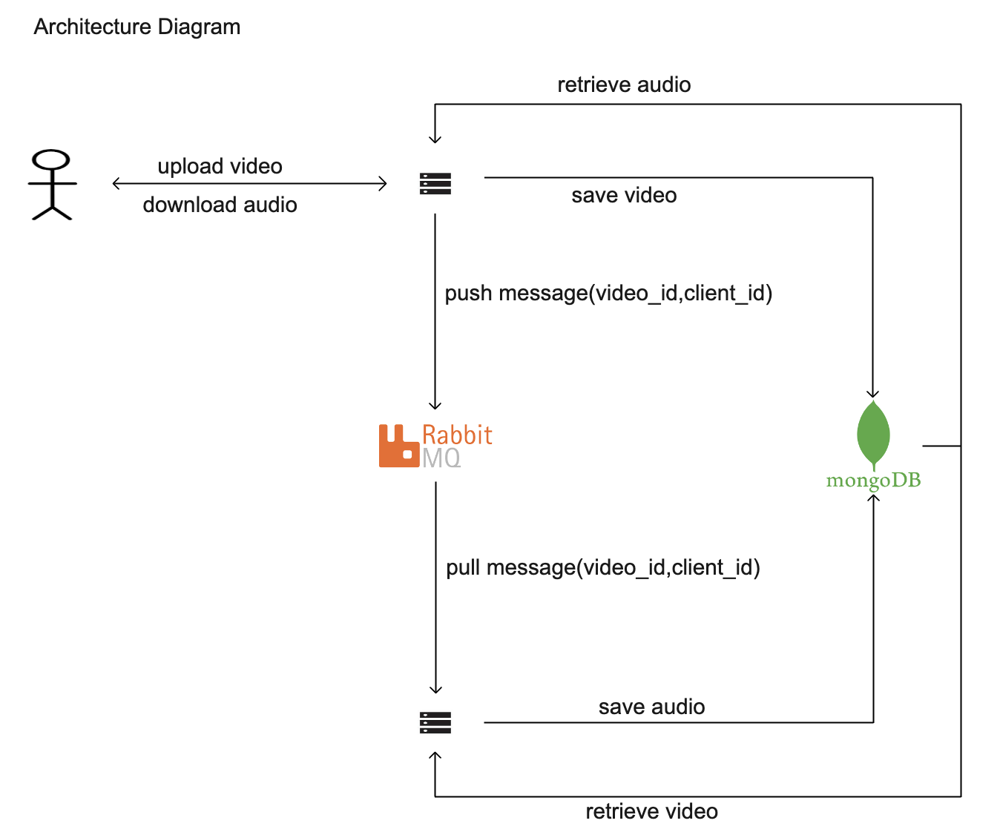

### AudioTap
#### Introduction
* AudioTap is a web application leveraging Flask, RabbitMQ, and MongoDB to provide a seamless video-to-audio conversion.
* Users can easily upload videos, monitor conversion progress and download the converted audio files once ready, all through a user-friendly interface.

#### Architecture:
  

#### Demo Video
https://github.com/vedesh95/videotomp3/assets/50790991/87070cd4-1145-4ab1-9281-f68690676c98

#### Setup:  
1. install mongodb, rabbitmq  
2. make video_audio db in mongodb. Command: use video_audio
3. make client_videos collection in the above db. Commmand: db.createCollection("client_videos")
4. login to rabbitmq on localhost and make a queue video_queue
5.  go to gateway. activate venv. pip install. then run command - "flask run"
6.  go to processor. activate venv. pip install. then run command - "python3 server.py"
7. you can access on - "http://127.0.0.1:5000"
